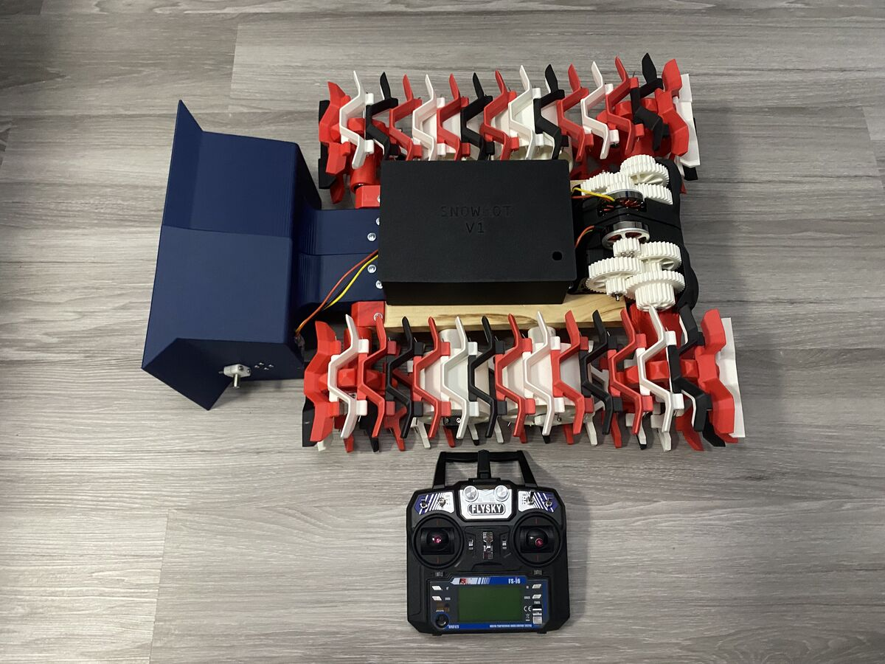
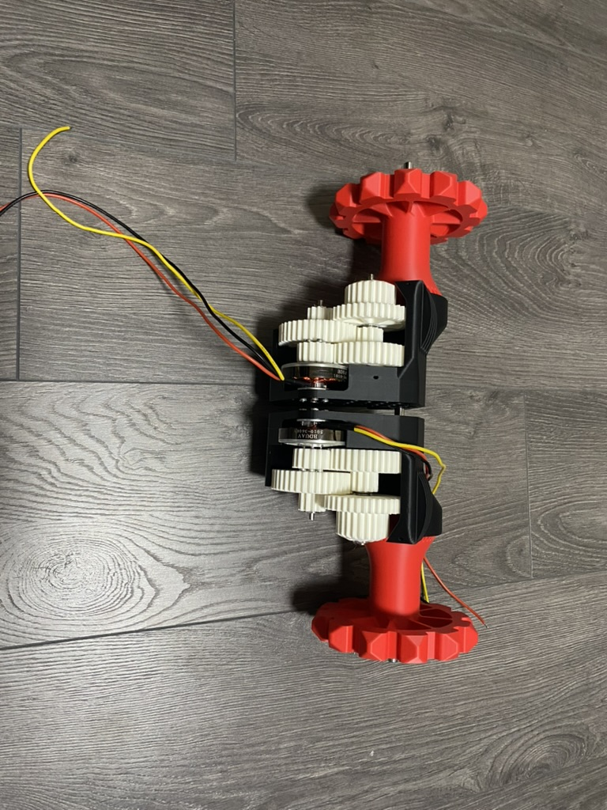
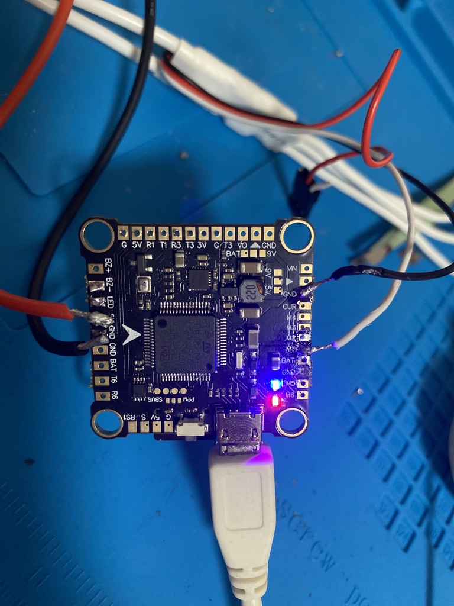
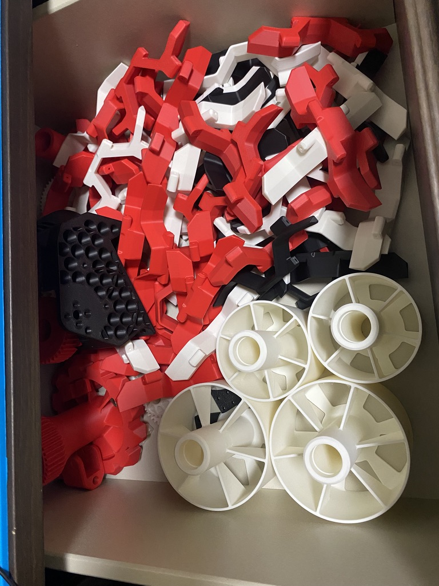

# Snowbot Rover

An autonomous GPS-guided snowblower rover built on ArduPilot Rover with brushless motors, skid steering, and RC override.



---

## Overview

Snowbot is a tracked rover designed to autonomously remove snow using a brushless impeller. It runs ArduPilot Rover on an Omnibus F4 flight controller and supports both manual RC control and GPS waypoint navigation. The project was built for an engineering fair and combines embedded systems, power electronics, robotics, and mechanical design.

---

## Features

- Skid steering via two independent brushless drive motors
- Brushless snow impeller controlled independently from the drive system
- Manual RC control via FlySky IBUS
- GPS waypoint navigation via ArduPilot Rover
- Built on the open-source RC Snowcat chassis by RCTestFlight, printed in PLA

---

## Hardware

| Component | Qty | Notes |
|---|---|---|
| 5010 Brushless Motor 360KV 2-6S | 3 | 2x drive, 1x impeller |
| 30A BLHeli ESC (bidirectional, 2-4S) | 2 | Drive motors |
| 40A Waterproof ESC (2-4S) | 1 | Impeller motor |
| Omnibus F4 Flight Controller | 1 | STM32F405 |
| 4S LiPo Battery 6000mAh XT60 | 1 | |
| Power Distribution Board | 1 | 5V regulated output for FC |
| BE-220 GPS Module | 1 | |
| FlySky FS-i6 Transmitter | 1 | |
| FlySky FS-iA6B Receiver | 1 | IBUS protocol |
| 8mm Hardened Steel Linear Bearing Rod 400mm | 4 | |
| F694zz Flanged Ball Bearings (4x11x4mm) | 12 | |
| 22x8x7 Skateboard Bearings | 16 | |
| 4mm Steel Rods (gearbox axles) | 4 | 95mm and 80mm |
| Music Wire 0.055in x 36in | 8 | ~35 x 100mm segments per track |
| Wood Plank | 1 | Chassis base |
| PLA Filament | ~1kg | All project-specific printed parts |

Full BOM in [`hardware/bom.csv`](hardware/bom.csv).

---

## Wiring

### Power
```
Battery (4S LiPo) -> PDB -> ESCs (x3)
                  -> PDB -> Flight Controller (5V)
```

### ESC Outputs

| FC Output | Assignment |
|---|---|
| M1 | Left Drive Motor |
| M2 | Right Drive Motor |
| M3 | Impeller Motor |

Each ESC: Signal (White) and Ground (Black) to FC. Red BEC wire left disconnected — FC is powered from PDB.

### RC Receiver (IBUS)
```
FS-iA6B IBUS Signal -> FC UART RX
FS-iA6B 5V         -> FC 5V
FS-iA6B GND        -> FC GND
```

### GPS
```
GPS TX  -> FC RX
GPS RX  -> FC TX
GPS 5V  -> FC 5V
GPS GND -> FC GND
```

---

## Software

ArduPilot Rover configured for skid steering. Output assignments:

| Parameter | Value |
|---|---|
| SERVO1_FUNCTION | Left Motor |
| SERVO2_FUNCTION | Right Motor |
| SERVO3_FUNCTION | Impeller Motor |

Mission Planner (Windows) was used for all configuration. QGroundControl was tested on macOS but has limited ArduPilot support.

---

## Project Status

| Feature | Status |
|---|---|
| Skid steering | Done |
| RC manual control | Done |
| Brushless motor control | Done |
| Impeller control | Done |
| ArduPilot configuration | Done |
| GPS wiring and configuration | Done |
| Autonomous waypoint navigation | Implemented, field testing pending |
| Compass / magnetometer | Not added |
| Obstacle avoidance | Planned |
| Camera system | Planned |

---

## Build Photos







---

## Credits

- Chassis: [RCTestFlight](https://www.youtube.com/@RCTestFlight) open-source RC Snowcat design
- Firmware: [ArduPilot](https://ardupilot.org/)
- Ground control: [Mission Planner](https://ardupilot.org/planner/)

---

## License

MIT License — see [LICENSE](LICENSE) for details.

---

*Built by Danny Alrayyes*
